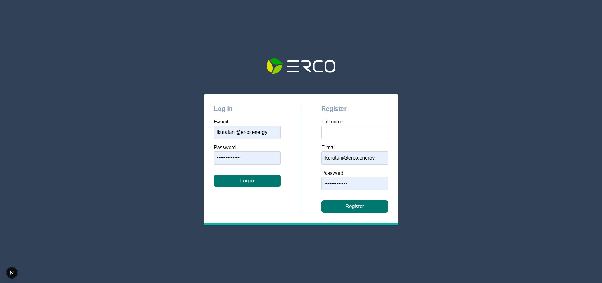
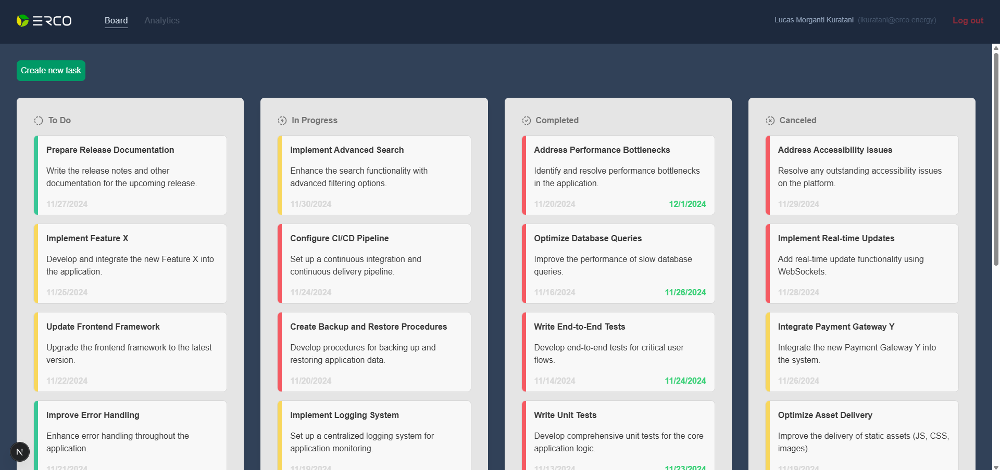
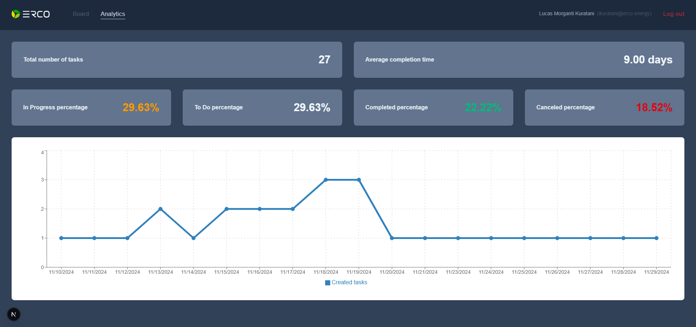

# Erco Energy - Mid Level Fullstack Developer Challenge





## Summary

Requirements:

- Node.js version 20 or higher
- Docker

---

Stack chosen and why:

The programming language used is Typescript.

The frontend is made with Next.js version 15, and it makes use of awesome features like server actions, server components and mostly server side rendering. For styling, I used Tailwind, it is realy good and I was able to speed up the styling process with it. The chosen charting library is Recharts and the reason is just that I use it at work. It's good though, very flexible and modular, made for React.

The backend is made with AdonisJS, a fully fledged MVC framework. It's just like NestJS, but much more fun to work with. It comes out of the box with routing, database support, ORM (lucid), authentication, etc.

The chosen database is MySQL. There is not much to this choice, it's just the one I'm most used to work with. 

## How to install the project

Clone the repository:

```bash
git clone https://github.com/lucasKuratani/erco-energy-challenge.git
```

Start the database. It might take a while:

```bash
docker compose up
```

Install the dependencies and start the frontend:

```bash
cd frontend

npm install

npm run build

npm run start
```

Install the dependencies, seed the database and start the backend:

```bash
cd backend

npm install

node ace migration:run

node ace db:seed

node ace serve --watch
```

# Analytics

The metrics I considered for this project are the following ones:

- Total number of tasks (simple metric, not much to it)
- Average completion time (so the user knows if it is taking them too long to complete the tasks)
- Percentage of each tasks status (so the user knows if too many tasks are stuck in each one of the statuses)
- Chart of tasks created per day (so the user knows one which days he created more tasks)

# Design

For the design, I used Trello as an inspiration (it's much simpler of course), where each task status has its own column. There's not much to the analytics design, I just tried to make the infomation as easy as possible to read, with big letters and saturated colors.

# Authentication

The authentication is managed entirely by AdonisJS. According to [Adonis's documentation]('https://docs.adonisjs.com/guides/authentication/access-tokens-guard'), the tokens are not considered JWT, but rather opaque, since they do not follow the JWT standard, because Adonis implements its own token generation logic. Although its not considered JWT, the authentication flow would be the same if it was.

# Validation

There's validation on both the frontend and the backend. In the backend, Adonis uses a library called Vine. Next.js does not come with a built in validator, so I chose to use Zod.

# Conclusion

Initialy I created the frontend and the backend separately, and then had to delete the .git folder from each one, so both are included in one repository. That's why there's not many commit messages. In the backend, I removed the .env file from the .gitignore file, just so it is easier for you to start it. I'd never do it in a real project.

The application supports user registration, but to make it easier to see something drawn right after starting the project, there are some seeders that populate the database with arround 40 tasks. They are from the user **lkuratani@erco.energy**, and the password is **safe_password** (not safe at all, but its for development only). The tasks seeder would probably not be used in production.

There's plenty of room for improvements, that would have been done, had I more time. For example, it is missing the drag and drop feature, the user has to open the edit modal to edit the tasks status. Maybe implement more metrics in the analytics page. Definetly improve error handling and alerts.

Feel free to contact me at *lucaskuratani@gmail.com* in case of any problems.
